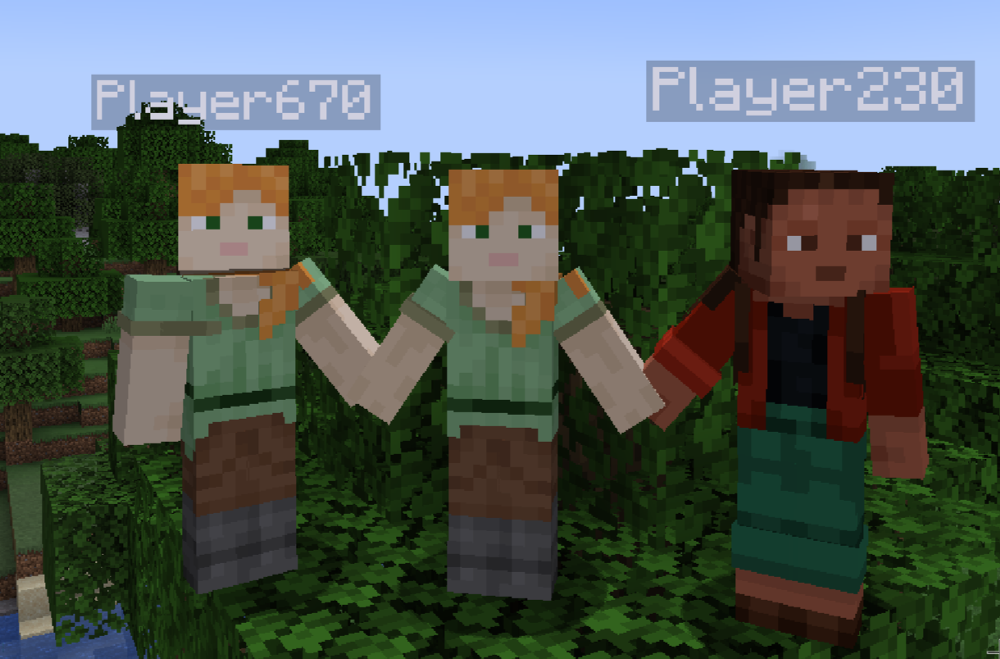

# HandHolding

Ever wanted to hold hands with your "friends" in Minecraft? Then this mod is for you! Just press the designated
keybinds (`G` for left hand and `H` for right hand) while looking at your friends to hold hands with them (they'll have
to hold your hand back)
